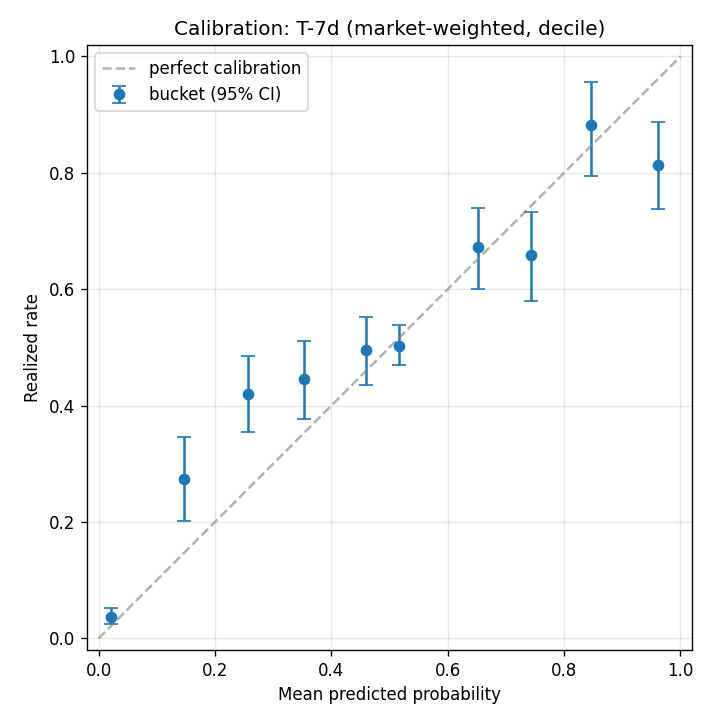

# calibration-tracker

> Are Polymarket prices well calibrated? At market close: yes, perfectly. A week before resolution: depends on the category.

A reproducible calibration analysis of resolved Polymarket binary markets. Pulls market metadata and price history via Polymarket's public APIs, extracts price snapshots at four horizons before resolution (close, T-1h, T-24h, T-7d), and computes Brier score, log loss, and per-bucket realized rates with bootstrap confidence intervals.

**Full writeup:** [`reports/v1_calibration.md`](reports/v1_calibration.md)

## Headline result

| Snapshot | n markets | Brier | Log loss |
|---|---|---|---|
| close | 4,522 | 0.0001 | 0.0009 |
| T-1h | 4,521 | 0.0018 | 0.0066 |
| T-24h | 4,393 | 0.163 | 0.469 |
| T-7d | 2,905 | 0.185 | 0.535 |

For reference: 0 is perfect calibration, 0.25 is the always-predict-0.5 chance baseline.

The story is in the T-7d by-category breakdown:

| Category | n | Brier (T-7d) |
|---|---|---|
| **sports** | **1,425** | **0.238** |
| crypto | 620 | 0.144 |
| other | 370 | 0.132 |
| geopolitics | 317 | 0.129 |
| politics | 156 | 0.116 |
| entertainment | 17 | 0.077 |

A week before tipoff, Polymarket sports markets are barely better than coin flips. A week before an election, they carry real predictive signal.



## Quickstart

```bash
git clone https://github.com/ian-menachery/calibration-tracker
cd calibration-tracker
python -m venv .venv
.venv/Scripts/activate           # macOS/Linux: source .venv/bin/activate
pip install -r requirements.txt

python -m calibration.cli discover --since 2024-01-01      # ~30 s
python -m calibration.cli fetch-prices                     # ~30 min
python -m calibration.cli extract-snapshots                # ~5 s
python -m calibration.cli analyze                          # ~30 s
```

Outputs land in `data/markets.db` (SQLite) and `reports/`.

## Repo layout

```
src/calibration/
  polymarket/     # Gamma + CLOB API clients (Stages 1, 2)
  storage/        # SQLite schema + repository helpers
  analysis/       # snapshot extraction (Stage 3) + bucketing/metrics (Stage 4)
  reporting/      # matplotlib calibration charts
  cli.py          # argparse entry point — one subcommand per stage
tests/            # 61 unit tests covering math + storage
reports/          # writeup + figures
```

Design doc: [`ARCHITECTURE.md`](ARCHITECTURE.md). API gotchas, session log, and v2 considerations: [`NOTES.md`](NOTES.md).

## Stack

Python 3.11+, [httpx](https://www.python-httpx.org/), [pandas](https://pandas.pydata.org/), [numpy](https://numpy.org/), [matplotlib](https://matplotlib.org/), [pydantic](https://docs.pydantic.dev/), [pytest](https://docs.pytest.org/), [ruff](https://docs.astral.sh/ruff/), and stdlib `sqlite3`. No other dependencies.

## License

MIT — see [`LICENSE`](LICENSE).
