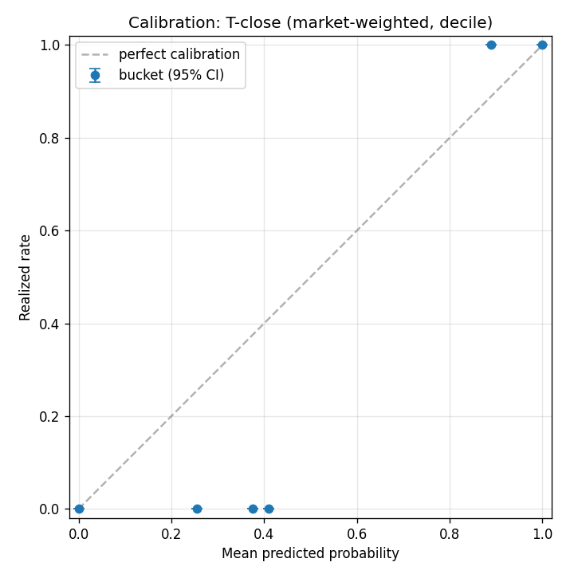
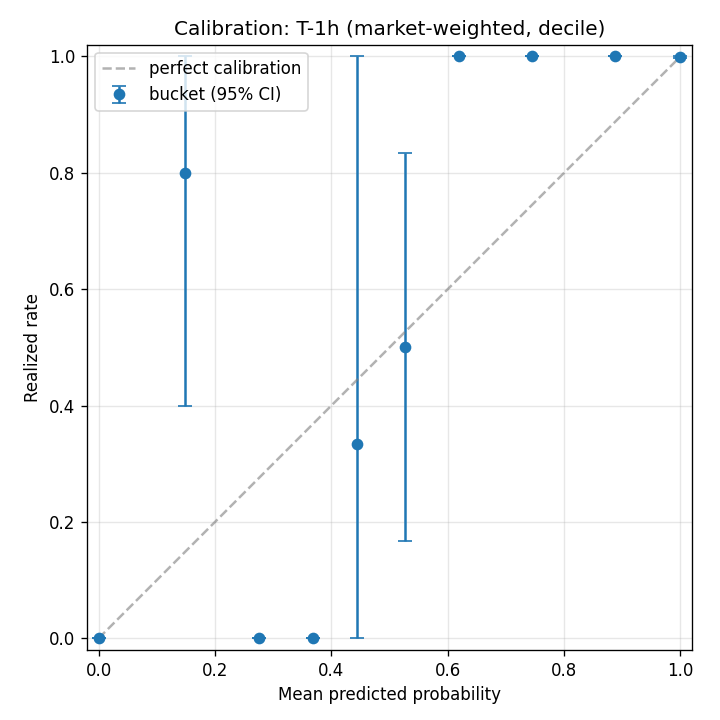
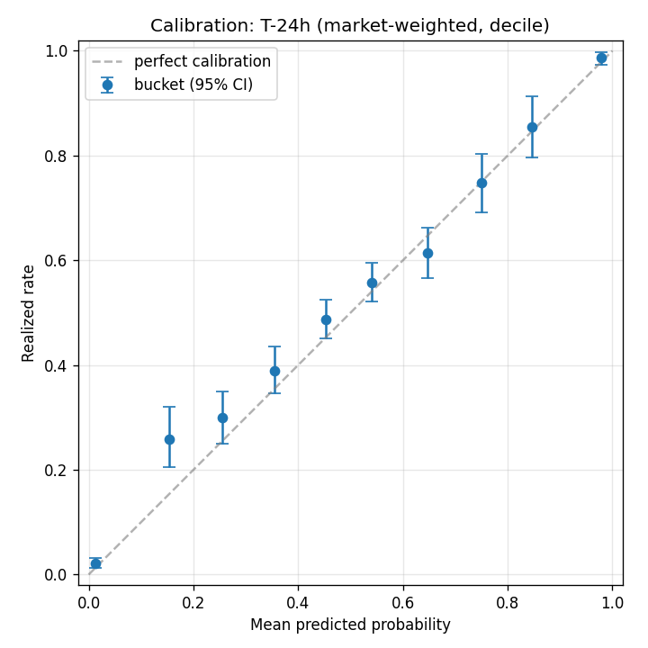

# Are Polymarket prices well calibrated?

When a Polymarket binary market is trading at 70%, does YES actually
resolve 70% of the time? And does the answer change as you move from
the moment of resolution back to a week before? This writeup is the v1
analysis: a clean dataset, the math, and the headline finding.

> **v1.1 update (2026-05-08).** Categorization swapped from a slug-prefix
> heuristic to Polymarket's own `tags` taxonomy via the Gamma `/events/{id}`
> endpoint. The "other" bucket shrank dramatically (T-7d: 370 → 83
> markets; T-24h: 678 → 92), with most reclassified into politics,
> geopolitics, and crypto. Headline numbers are essentially unchanged —
> sports T-7d Brier moved 0.238 → 0.236, politics 0.116 → 0.106. The
> caveat about coarse categorization is gone; the per-category tables
> below now use the tag-based numbers.

## TL;DR

For 4,522 standalone binary Polymarket markets above $1M in volume that
resolved between January 2024 and May 2026:

- At market **close**, prices are essentially perfectly calibrated
  (Brier score 0.0001).
- At **1 hour before resolution**, calibration is still excellent
  (Brier 0.0018) — the market has done its job.
- At **24 hours and 7 days before resolution**, real predictive
  uncertainty appears (Brier 0.163 and 0.185).
- The headline split is by category. **At T-7d, sports markets are
  almost uncalibrated** — Brier 0.236, barely better than the
  chance-baseline of 0.25. By contrast, **political and geopolitical
  markets carry meaningful predictive signal a week out** (Brier 0.106
  and 0.140 respectively).

Polymarket prices a Lakers game seven days out about as well as a coin
flip. It prices a presidential election seven days out much better than
a coin flip. That's the headline.

## What "calibration" means here

A binary forecast is well calibrated if, when you look at all the times
it predicted X%, the event actually happened X% of the time. Calibration
is what you'd hope to recover from a deep, liquid prediction market: if
the wisdom-of-crowds story is right, prices should map to frequencies.

Existing public answers to this question for Polymarket are sparse, dated,
or methodologically thin. This is a self-contained replication: pull
resolved markets, reconstruct the price at fixed offsets before
resolution, bucket by predicted probability, compute realized rates, and
score with Brier and log loss. The full code and dataset are linked at
the bottom.

## The dataset

- **Source:** Polymarket's public Gamma API for market metadata and the
  CLOB `prices-history` endpoint for time series.
- **Filter:** `closed=true` resolved markets above $1M in trading volume,
  ending on or after 2024-01-01. The volume floor was raised from the
  initial guess of $1k after discovering Gamma's `/markets` endpoint caps
  pagination at offset 100,000 — Polymarket has well over 100k closed
  markets above $1k, so the long tail is unreachable. $1M biases the
  sample toward popular categories (sports, geopolitics, crypto,
  politics) and away from anything micro.
- **Scope:** 4,522 standalone binary markets. Multi-outcome events
  modeled as `negRisk` sub-markets on Polymarket (e.g., the
  individual-candidate components of "who will win the 2024 election")
  are excluded from v1; they'll join the dataset in a later phase.
- **Mix:** sports is the majority by count — 62.1% of all markets above
  the $1M floor. Crypto is 18.8%, geopolitics 10.4%, politics 6.2%,
  "other" 2.0%, entertainment 0.5%. The sports concentration matters
  for reading the overall numbers below.
- **Resolution window:** 2024-01-10 → 2026-05-07. About 16 months of
  resolved markets.

## Methodology

For each market we extract four price snapshots and pair them with the
realized binary outcome (1.0 if YES won, 0.0 if NO won):

| Snapshot | Definition |
|---|---|
| `close` | Last tick at or before the UMA resolution timestamp |
| `1h` | Closest tick to (resolution − 1 hour) |
| `24h` | Closest tick to (resolution − 24 hours) |
| `7d` | Closest tick to (resolution − 7 days) |

Tolerances around each target time are tight (≤30 minutes for 1h, 2h for
24h, 12h for 7d). Snapshots that fall outside tolerance are
**omitted**, never invented or filled with zeros — so the cohort sizes
shrink as we move further from resolution. 4,522 markets have a
`close` snapshot; only 2,905 reach 7 days back.

Resolution timestamps come from Gamma's `umaEndDate` (the actual UMA
resolution time), not the scheduled `endDate` field, which can drift by
hours or days. The Trump 2024 market, for instance, was scheduled to
end at 2024-11-05T12:00 UTC but actually resolved 27 hours later.

For each snapshot type we then:

1. Bucket markets by predicted probability into both decile bins
   `[0.0, 0.1), [0.1, 0.2), …` and finer 5% bins.
2. Compute the **realized rate** per bucket (mean outcome) plus a 95%
   bootstrap confidence interval (1,000 resamples).
3. Compute **Brier score** (mean squared error of probability vs binary
   outcome) and **log loss** overall and by subgroup.

We compute both market-weighted (one row, one vote) and volume-weighted
versions. The headline charts below are market-weighted, decile bins.

## Results

### Overall by horizon

| Snapshot | n markets | Brier | Log loss |
|---|---|---|---|
| close | 4,522 | **0.0001** | 0.0009 |
| 1h | 4,521 | **0.0018** | 0.0066 |
| 24h | 4,393 | 0.163 | 0.469 |
| 7d | 2,905 | 0.185 | 0.535 |

For reference: predicting 0.5 on every market (always saying "coin
flip") would give a Brier of 0.25. Perfect calibration is 0. So 0.0001
at close is essentially indistinguishable from "the market knew the
answer", and 0.185 at T-7d is meaningfully better than chance but well
short of perfect.

#### Calibration curves



At market close, every bucket sits exactly on the diagonal — the price
near resolution is essentially the realized outcome.



One hour out, the picture is nearly identical. At this horizon the
market has already done most of its work.



24 hours out, real uncertainty emerges — the middle buckets pull away
from the diagonal, particularly for prices in the 0.4-0.7 range.


A week out, the curve sags further. There's still signal — markets
priced near 0 still mostly resolve NO, markets priced near 1 still mostly
resolve YES — but the buckets in the middle are far from the diagonal.

### The headline: T-7d by category

| Category | n | Brier | Log loss |
|---|---|---|---|
| **sports** | **1,475** | **0.236** | 0.663 |
| entertainment | 20 | 0.154 | 0.477 |
| crypto | 699 | 0.141 | 0.422 |
| geopolitics | 385 | 0.140 | 0.422 |
| politics | 243 | 0.106 | 0.338 |
| other | 83 | 0.107 | 0.327 |

(Categories assigned via Polymarket's own `tags` taxonomy from the Gamma
`/events/{id}` endpoint, with a slug-prefix fallback for the rare
markets whose tags don't intersect any of the six buckets.)

Sports is *the* story. At Brier 0.236 it sits a hair below the
chance-baseline of 0.25 — meaning a week before tipoff or first pitch,
Polymarket prices on individual game outcomes are barely better than
flipping a coin. The other categories are meaningfully better: politics
at 0.106 and geopolitics at 0.140 carry real signal seven days out.

(Entertainment at 0.154 looks worse than crypto/geopolitics, but with
only 20 markets in the cohort the bootstrap interval is wide — read
that row as "we don't have a clean answer here yet.")

This makes intuitive sense. A week before an NBA game, the outcome
depends on player health, opponent matchups, and shooting variance — most
of which is hard to predict that far ahead. A week before an election or
a ceasefire, more of the relevant information is structural and stable.

### T-24h echoes the same split

| Category | n | Brier | Log loss |
|---|---|---|---|
| **sports** | **2,683** | **0.224** | 0.637 |
| crypto | 848 | 0.085 | 0.259 |
| geopolitics | 467 | 0.064 | 0.188 |
| politics | 280 | 0.037 | 0.118 |
| other | 92 | 0.035 | 0.119 |
| entertainment | 23 | 0.024 | 0.063 |

Sports is still the laggard at 24h out (Brier 0.224 — even the day
before the game is barely better than chance), while everything else
has tightened up considerably. Politics drops to 0.037 a day out —
extremely well calibrated.

### Volume doesn't rescue the 7-day picture

| Volume quartile | range (USD) | n | Brier (T-7d) |
|---|---|---|---|
| q1 | $1.0M – $1.3M | 727 | 0.190 |
| q2 | $1.3M – $1.8M | 726 | 0.180 |
| q3 | $1.8M – $3.0M | 726 | 0.200 |
| q4 | $3.0M – $269M | 726 | 0.170 |

Higher-volume markets are slightly better calibrated at T-7d but the
relationship isn't monotonic, and the spread between best (q4 at 0.170)
and worst (q3 at 0.200) is small. The category effect dominates the
volume effect.

## Caveats

A few things to keep in mind before extrapolating from this:

- **Selection bias.** Polymarket only lists markets people want to bet
  on. Calibration of "popular markets people thought were interesting"
  doesn't necessarily generalize to all binary forecasting.
- **Volume floor bias.** $1M+ heavily weights the sample toward
  elections, geopolitics, crypto, and major US sports. The long tail of
  $1k-$1M markets is excluded for a tractable v1.
- **Categorization** uses Polymarket's own `tags` taxonomy via Gamma's
  `/events/{id}` endpoint (v1.1 swap from a slug heuristic). Each market's
  category is the first of {sports, entertainment, crypto, geopolitics,
  politics, other} whose tag set intersects the market's tags; markets
  whose tags only match meta-slugs (`recurring`, `hit-price`, etc.) fall
  back to the slug heuristic. The "other" cohort is small (~83 at T-7d,
  ~92 at T-24h) and consists mostly of niche or experimental markets.
- **Multi-outcome events excluded.** The most famous Polymarket market
  of all — the 2024 US Presidential Election ($1.5B in volume) — is
  *not* in this dataset because it's structured as a `negRisk`
  sub-market. Multi-outcome decomposition is on the v2 list.
- **Cohort shrinkage.** Only 2,905 markets had at least 7 days of
  trading history; the other 1,617 are absent from the T-7d cohort
  (mostly short-duration sports and event markets). This biases the 7d
  cohort toward longer-running markets.
- **One missing market.** The full backfill skipped one market on a
  transient connection drop; 4,522 of 4,523 markets carry price history.
- **UMA-disputed markets.** Markets that resolved through Polymarket's
  UMA dispute process are included undifferentiated. Treating them as
  a separate cohort is a v2 follow-up.

## How this compares to Polymarket's own accuracy page

Polymarket publishes its own calibration numbers at
<https://polymarket.com/accuracy>. Their page reports an overall Brier
score of 0.0627 across "all resolved polymarkets" (no volume floor
disclosed), plus a hit-rate metric — the share of markets where the
final leading outcome matched the resolution — that runs from 96.7%
four hours before resolution down to 90.4% one month out. Their Brier
is broken out by volume tier (under $1k through $1M+); they reference a
Dune dashboard for deeper Brier analysis.

| | Polymarket's page | This writeup |
|---|---|---|
| Horizons | 4h / 12h / 1d / 1w / 1mo | close / 1h / 24h / 7d |
| Sample | "all resolved polymarkets" | 4,522 standalone binary, $1M+ volume |
| Metrics | Brier, hit rate | Brier, log loss, bootstrap CIs |
| Subgroup breakdown | volume tier | **category** + volume quartile |
| Code / data | closed | MIT, in this repo |

The two analyses overlap on T-24h ≈ 1 day and T-7d ≈ 1 week. We don't
cover the 4h / 12h / 1mo horizons (the 1-month one would require
extending Stage 2's price-fetch window past CLOB's ~14-day cap), and
their sample is broader than ours. What this writeup adds that the
official page doesn't: the **category breakdown** — the sports-vs-
everything-else divergence at T-7d isn't visible when you only slice by
volume — plus log loss alongside Brier, per-bucket realized rates with
bootstrap CIs, and an open dataset and code path that anyone can re-run.

A direct numeric comparison isn't apples-to-apples: their headline
Brier of 0.0627 pools across all five horizons, doesn't apply a $1M
floor, and presumably includes the multi-outcome `negRisk` sub-markets
we exclude. The two should be read as complementary rather than
contradictory.

## What's next

- **Phase 6 — multi-outcome decomposition.** The most expensive markets
  on Polymarket are the multi-candidate election events. Decomposing
  these into per-outcome binary YES/NO markets and rolling them into the
  dataset will dramatically expand both volume and category coverage.
- **Lower the volume floor.** A revisit at $100k volume would broaden
  category coverage substantially, especially in entertainment, niche
  politics, and longer-tail topics. Requires chunking discovery by
  end-date windows to fit under Gamma's pagination cap.
- **Cross-platform comparison.** Add Kalshi as a second data source.
  Different resolution mechanism, different audience, different
  categorical mix.

## Reproducibility

Repo: <https://github.com/ian-menachery/calibration-tracker>

To rebuild the entire dataset and analysis from scratch:

```
git clone https://github.com/ian-menachery/calibration-tracker
cd calibration-tracker
python -m venv .venv
.venv/Scripts/activate           # or .venv/bin/activate on macOS/Linux
pip install -r requirements.txt

python -m calibration.cli discover --since 2024-01-01      # ~30 s
python -m calibration.cli fetch-tags                       # ~15 min
python -m calibration.cli fetch-prices                     # ~30 min
python -m calibration.cli extract-snapshots                # ~5 s
python -m calibration.cli analyze                          # ~30 s
```

Outputs land in `data/markets.db` (SQLite) and `reports/`. The math is
in `src/calibration/analysis/{metrics,calibration,snapshots}.py` and
covered by 84 unit tests.

Stack: Python 3.11+, httpx, pandas, numpy, matplotlib, sqlite3, pydantic,
pytest, ruff. No other dependencies.

---

*Ian Menachery · May 2026 · MIT-licensed · Repo: <https://github.com/ian-menachery/calibration-tracker>*
